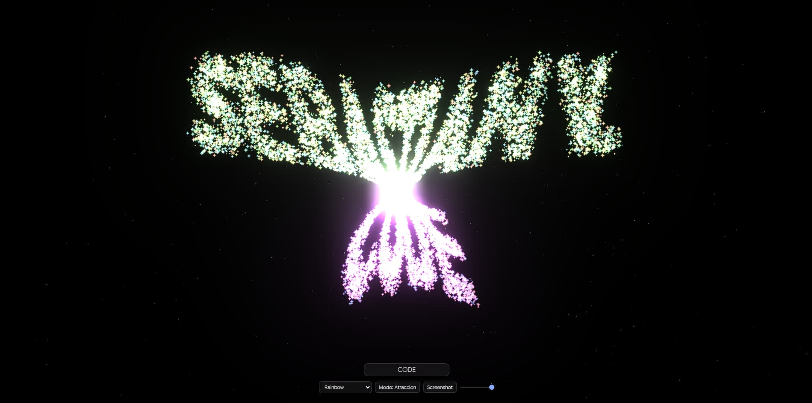

<p align="center">
  
</p>


# Particle Text

> *Where typography meets light.*


A real-time particle typography experience built with Three.js. Text dissolves into thousands of luminous sparkles that react to your cursor, explode on click, and reform into whatever you type.

---

## Table of Contents

- [Overview](#overview)
- [Features](#features)
- [Tech Stack](#tech-stack)
- [Getting Started](#getting-started)
- [How It Works](#how-it-works)
- [Controls](#controls)
- [Color Themes](#color-themes)
- [Architecture](#architecture)
- [Shader System](#shader-system)
- [Performance](#performance)
- [Future Improvements](#future-improvements)
- [License](#license)

---

## Overview

**Particle Text** is an interactive WebGL experiment that transforms text into a field of glowing particles. Each character is rendered to an off-screen canvas, sampled at the pixel level, and mapped into a Three.js particle system — creating a living, breathing typographic sculpture.

The particles don't just sit there. They **flee from your cursor**, **explode on click**, and **smoothly reform** into new text as you type. All in real time, all in the browser.

---

## Features

| Feature | Description |
|---|---|
| **Live Text Input** | Type anything — particles reform instantly into your text |
| **Sparkle Shader** | Custom GLSL fragment shader creating 4-pointed star shapes |
| **Mouse Repulsion** | Particles scatter away from the cursor within a defined radius |
| **Attraction Mode** | Toggle to pull particles toward the cursor instead |
| **Click Explosion** | Click anywhere to blast particles outward; they recover after 2 seconds |
| **4 Color Themes** | Neon, Pastel, Monochromatic, and Rainbow palettes |
| **Bloom Post-Processing** | UnrealBloomPass adds cinematic glow to every particle |
| **Background Particles** | 600 ambient particles float with sinusoidal motion for depth |
| **Dynamic Count** | Slider adjusts particle count from 2,000 to 20,000 in real time |
| **OrbitControls** | Drag to orbit, scroll to zoom, explore the 3D space |
| **Screenshot Export** | One-click PNG download of the current scene |
| **Custom Font** | Google Sans Flex loaded via Google Fonts |

---

## Tech Stack

- **[Three.js](https://threejs.org/)** — 3D rendering engine
- **[GLSL](https://www.khronos.org/opengl/wiki/OpenGL_Shading_Language)** — Custom vertex and fragment shaders
- **[EffectComposer](https://threejs.org/docs/#examples/en/postprocessing/EffectComposer)** — Post-processing pipeline
- **[Google Sans Flex](https://fonts.google.com/specimen/Google+Sans+Flex)** — Typography
- **Vanilla JS** — No frameworks, no build tools, no dependencies

---

## Getting Started

### Prerequisites

A modern browser with WebGL 2 support. No server required — but some browsers restrict `importmap` over `file://`, so a local server is recommended.

### Run

```bash
# Option 1: Python
python -m http.server 8000

# Option 2: Node.js
npx serve .

# Option 3: VS Code
# Install "Live Server" extension, then right-click index.html → Open with Live Server
```

Open `http://localhost:8000` in your browser.

### File Structure

```
particles/
├── index.html    # Entry point, UI controls, import map
├── style.css     # Glassmorphism UI, slider, responsive layout
└── main.js       # Three.js scene, shaders, particle logic
```

---

## How It Works

### Text Sampling

1. Each character is rendered to an off-screen `<canvas>` using the 2D API
2. Pixel data is read with `getImageData()`
3. White pixels (alpha > 128) become 3D coordinates, mapped from screen space to world space
4. A small random offset is added per particle for organic spread

### Particle Formation

Particles start at random positions across a 25×15×12 unit volume. On each frame, every particle interpolates toward its target position using linear interpolation:

```js
positions[i] += (target - positions[i]) * 0.06;
```

This creates the fluid "formation" effect — particles drift into place like a swarm finding its shape.

### Mouse Interaction

The mouse position is projected onto a plane perpendicular to the camera using `Raycaster`. For each particle, the distance to the mouse is computed. Within the interaction radius, a force vector is applied:

- **Repulsion**: Pushes particles away from the cursor
- **Attraction**: Pulls particles toward the cursor

### Explosion

On click, every particle receives a radial impulse away from the click point. The force is randomized (8–14 units) for a natural scatter. After 2 seconds, `isExploding` resets and particles reform.

---

## Controls

| Input | Action |
|---|---|
| **Drag** | Orbit the camera around the scene |
| **Scroll** | Zoom in / out |
| **Move mouse** | Repel or attract particles (depending on mode) |
| **Click** | Explode particles outward |
| **Type in input** | Particles reform into the new text |

### UI Elements

| Element | Function |
|---|---|
| **Text Input** | Enter custom text (max 20 characters) |
| **Theme Selector** | Switch between Neon, Pastel, Monochromatic, Rainbow |
| **Particle Slider** | Adjust count from 2K to 20K |
| **Mode Button** | Toggle between Repulsion and Attraction |
| **Screenshot Button** | Download current view as PNG |

---

## Color Themes

| Theme | Palette | Style |
|---|---|---|
| **Neon** | Cyan, Magenta, Lime, Yellow, Purple, Blue | High saturation, electric feel |
| **Pastel** | Soft Red, Green, Blue, Yellow, Orange, Lavender | Muted, warm, gentle |
| **Monochromatic** | 6 variations of blue | Cohesive, minimal, elegant |
| **Rainbow** | Full HSL spectrum mapped across particles | Every particle gets a unique hue |

Colors are assigned per-particle with slight random variation (±0.075) to avoid flat, uniform appearance.

---

## Architecture

### Scene Graph

```
Scene
├── AmbientLight (0x334466, intensity 1.0)
├── DirectionalLight (white, intensity 1.2)
├── PointLight (blue, 0x4488ff)
├── PointLight (orange, 0xff5533)
├── Points (text particles) ← ShaderMaterial
└── Points (background particles) ← ShaderMaterial
```

### Post-Processing Pipeline

```
Renderer
└── EffectComposer
    ├── RenderPass (scene → camera)
    └── UnrealBloomPass
        ├── strength: 0.8
        ├── radius: 0.4
        └── threshold: 0.85
```

### Data Flow

```
Input Text
  → Canvas 2D (render text)
  → Pixel Sampling (getImageData)
  → Target Positions (Float32Array)
  → Lerp Animation (each frame)
  → BufferGeometry Update
  → ShaderMaterial Render
  → Bloom Post-Processing
  → Screen
```

---

## Shader System

### Vertex Shader (Text)

```glsl
// Per-particle size scaling with distance
gl_PointSize = aSize * uPixelRatio * (60.0 / -mvPosition.z);

// Alpha fade based on distance from center
vAlpha = smoothstep(14.0, 6.0, dist) * 0.6 + 0.4;
```

### Fragment Shader (Sparkle)

The sparkle effect is composed of three overlapping shapes:

1. **Core** — A soft circle at the center (`smoothstep(0.35, 0.0, d)`)
2. **Horizontal arm** — Thin horizontal line through center
3. **Vertical arm** — Thin vertical line through center

```glsl
float sparkle = max(core, max(armX, armY));
sparkle = pow(sparkle, 1.5); // Sharpen the glow
```

### Background Shader

Background particles use sinusoidal displacement for organic floating motion:

```glsl
pos.y += sin(uTime * aSpeed + position.x * 2.0) * 0.3;
pos.x += cos(uTime * aSpeed * 0.5 + position.y) * 0.2;
```

---

## Performance

| Metric | Value |
|---|---|
| **Default particles** | 8,000 text + 600 background |
| **Max particles** | 20,000 text + 600 background |
| **Geometry** | `BufferGeometry` with `DynamicDrawUsage` |
| **Rendering** | `Points` with `AdditiveBlending` |
| **Pixel ratio** | Capped at 2× to prevent GPU overload |
| **Bloom** | Single-pass UnrealBloomPass |

### Optimizations

- `preserveDrawingBuffer: true` only enabled for screenshot support
- `depthWrite: false` prevents Z-fighting with transparent particles
- Particle positions updated via direct `Float32Array` mutation (no object allocation in loop)
- Mouse distance computed once per frame with cached `Vector3`

---

## Future Improvements

- [ ] **Audio reactivity** — Microphone input drives particle size or color
- [ ] **Gravity mode** — Particles fall and bounce
- [ ] **Trail effect** — Particles leave fading traces when moving
- [ ] **Texture particles** — Sample from a user-uploaded image
- [ ] **VR support** — WebXR integration for immersive viewing
- [ ] **Physics engine** — Verlet integration for more natural motion
- [ ] **Multi-language** — CJK character support with denser sampling
- [ ] **PWA** — Installable as a standalone app

---


<div align="center">

*Built with Three.js and a fascination for the space between code and light.*
</br>
Made with ❤️ by <a href="https://sebas-dev.vercel.app/" target="_blank" rel="noopener noreferrer">Sebastián V</a>

</div>